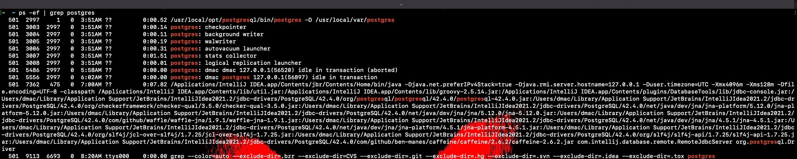
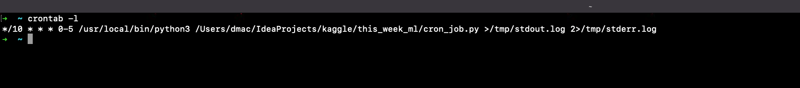
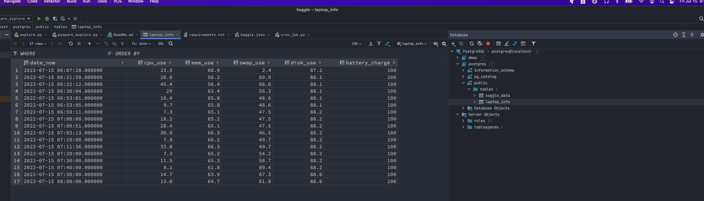
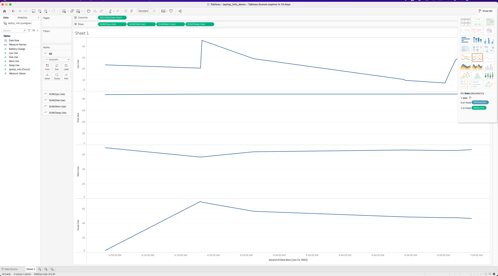

## Sample code for Kaggle Tabular Playground Series July 2022
- All code in this repository is running inside a python virtual env
- Requirements.txt will install all python dependencies

There are 3 small projects I want to highlight here
1. Sample data pipeline 
2. Pandas and matplotlib 
3. Pyspark

### Sample Data Pipeline
(file name: cron_job.py)
- I set up a postgres server running on my local laptop 
- I also set up a cron job that checks my laptop usage every 10 minutes and writes to this postgres table

- I am able to use tableau running locally and connect to this database

### Python sample job
(file name: explore.py)
- Some code I have along with documentation of when I made some submissions to the kaggle competition
- I also included the plots in the images/explore folder

### Pyspark Sample code
(filename pyspark_explore.py)
- I tried to create similar clusters as python but this has fewer plots
- I also included the plots in the images/spark folder

